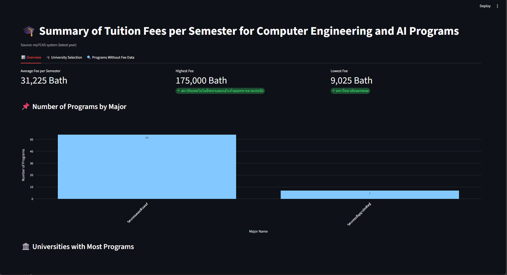

# 📷 ตัวอย่างหน้าจอ

---

# 🎓 Dashboard_MyTcas

ระบบ Dashboard สำหรับวิเคราะห์และแสดงข้อมูลของหลักสูตร TCAS จากหลายมหาวิทยาลัยทั่วประเทศไทยเน้นการสรุปค่าใช้จ่าย, รายละเอียดหลักสูตร, และแสดงข้อมูลที่ยังขาดหรือไม่สมบูรณ์

> พัฒนาโดยใช้ Python, Streamlit และ Plotly พร้อม web scraping ด้วย BeautifulSoup และ Selenium

---

## 📌 ฟีเจอร์เด่น

* สรุปจำนวนหลักสูตรรายสาขาแบบกราฟ
* กรองและค้นหาหลักสูตรตามมหาวิทยาลัย / วิทยาเขต
* แสดงรายการที่ไม่มีข้อมูลค่าใช้จ่าย พร้อมลิงก์ภายนอก
* แสดงผลข้อมูลแบบอินเตอร์แอคทีฟด้วย Streamlit

---

## 📁 โครงสร้างไฟล์โปรเจกต์

Dashboard_MyTcas/

├── webscrap.py              # ไฟล์สำหรับการดึงข้อมูลจาก web mytcas

├── cleandata.ipynb          # ไฟล์สำหรับการ clean data

├── dashboard.py              # ไฟล์หลักสำหรับแสดง dashboard

├── tcas_data.xlsx.txt          # data ที่ได้จากการดึงข้อมูลจาก web (raw_data)

├── tcas_cleaned.xlsx       # ข้อมูลหลักสูตรที่ clean แล้ว

├── tcas_no_fee.xlsx          # รายชื่อหลักสูตรที่ไม่มีข้อมูลค่าใช้จ่าย

├── requirements.txt          # รายการ dependencies ทั้งหมด

└── README.md                 # เอกสารประกอบโปรเจกต์ (ไฟล์นี้)

---

### 📦ติดตั้งไลบรารีที่จำเป็น

pip install -r requirements.txt

---

### ✅รัน Dashboard

streamlit run dashboard.py

---

## 👨‍💻 ผู้จัดทำ

**Jakapan Suwanraksa**

นักศึกษาสาขาวิศวกรรมปัญญาประดิษฐ์

รหัสนักศึกษา 6510110058

---
